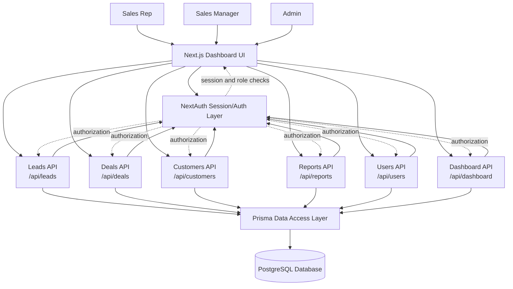

# CRM Architecture Diagrams

This document captures the current database structure and the core application data flow for the CRM system.

## ERD

```mermaid
erDiagram
  User {
    string id PK
    string name
    string email UK
    string passwordHash
    Role role
    string status
    datetime createdAt
  }

  Lead {
    string id PK
    string name
    string source
    LeadStatus status
    datetime createdAt
    datetime lastContactDate
    string ownerId FK
  }

  Customer {
    string id PK
    string name
    string companyName
    string email
    string phone
    string address
    string notes
    datetime createdAt
  }

  Deal {
    string id PK
    string title
    float amount
    DealStatus status
    int probability
    datetime createdAt
    datetime expectedCloseDate
    string assignedToId FK
    string customerId FK
    string leadId UK_FK
  }

  SalesReport {
    string id PK
    datetime startDate
    datetime endDate
    int totalDeals
    int closedDeals
    float conversionRate
    string generatedById FK
    datetime createdAt
  }

  User ||--o{ Lead : owns
  User ||--o{ Deal : assigned_to
  User ||--o{ SalesReport : generates
  Lead o|--|| Deal : converts_to
  Customer ||--o{ Deal : has
```

## DFD


